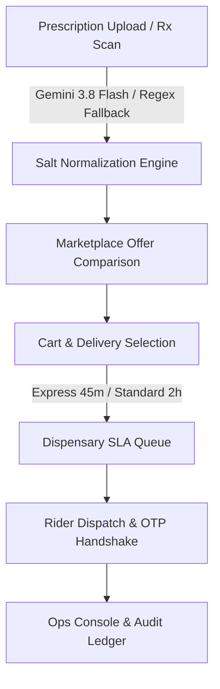

# GenericMed - Project Memory & Technical Blueprint

This document represents the long-term memory for the **GenericMed** platform. It details the system architecture, domain models, API specifications, business logic rules, active status, known issues, and future technical roadmap.

---

## 1. Project Overview

**GenericMed** is an enterprise-grade online generic medicine price comparison engine, multi-tenant pharmacy marketplace, and regulatory compliance platform tailored for the Indian healthcare ecosystem (CDSCO / Indian Pharmacopoeia standards).

### Core Mission
1. **Cost Transparency & Patient Savings:** Enable patients to upload medical prescriptions (Rx) or search for branded medicines (e.g. Calpol 650) to instantly discover bioequivalent generic substitutes (e.g. Paracip 650) offering savings of 50% to 70%.
2. **AI Prescription OCR:** Leverage Google Gemini 3.8 Flash multimodal vision AI to decipher complex handwritten doctor prescriptions and match active salts to generic catalogue inventory.
3. **Multi-Tenant Pharmacy Network:** Connect regional dispensaries, local chemists, and central fulfillment nodes under partitioned store schemas with real-time stock and SLA delivery management.
4. **Regulatory Governance & Compliance:** Provide Ops Leads, Pharmacists-in-Charge, and Regulators with auditing tools for master salt formularies, drug license verification, and pricing anomaly detection.

---

## 2. Tech Stack Summary

| Layer | Technology | Description |
| :--- | :--- | :--- |
| **Frontend Framework** | React 19.0 | Modern SPA client framework |
| **Language** | TypeScript 5.8 | Strict typing across components & APIs |
| **Build Tool & Server** | Vite 6.2 + Express 4.21 | Hot-module replacement dev server & production SPA hosting |
| **Runtime & Execution** | Node.js / `tsx` 4.21 / ESBuild | TypeScript execution server side |
| **AI Vision Engine** | Google GenAI SDK (`@google/genai` v2.4) | Multimodal prescription deciphering (`gemini-3.8-flash`) |
| **Styling & Icons** | Tailwind CSS v4.1 + Lucide React | Zero-config utility styling & vector icons |
| **Animations** | Motion 12.23 | Fluid drawer transitions & modal animations |
| **Analytics & Data Vis** | Recharts 3.10 | Dispensary GMV, SLA compliance, & fulfillment charts |

---

## 3. Implemented Features vs. Pending Roadmap



### Implemented Features (Completed)
- [x] **AI Prescription Scanner Modal:** Base64 image payload transmission, Gemini 3.8 Flash handwritten Rx deciphering, clinical summary extraction, confidence scoring, preset clinical samples fallback engine.
- [x] **Patient Price Comparison Marketplace:** Search by generic salt/brand, bioequivalence score display, price-per-tablet calculation, savings % badges, lowest price ranking, express vs. standard delivery filters.
- [x] **Cart & Slide-Over Drawer:** Real-time quantity adjustment, item removal, delivery cost calculation, order checkout toast notifications.
- [x] **Dispensary Portal View:** Active order fulfillment workflow (Needs Acceptance → Picking/Packing → Ready for Dispatch → Completed), timer countdowns, rider assignment with vehicle details & OTP verification, inventory SKU management.
- [x] **Ops Console View:** Real-time platform health summary, tenant GMV tracking, SLA breach alert system, Recharts fulfillment performance graphs.
- [x] **Master Formulary View:** CDSCO canonical salt catalog management, branded benchmark MRP comparisons, price anomaly flag reviews.
- [x] **Dispatch & Orders View:** Dispatch queue monitoring, delivery partner allocation, live OTP verification UI.
- [x] **IAM & Identity Management:** System accounts, role assignment (`Super Admin`, `Ops Lead`, `Pharmacist-in-Charge`, `Support`, `Patient`), drug license registration records, MFA state indicators.
- [x] **Super Admin View:** Multi-tenant cluster health monitoring (`TenantNode`), storage allocation, schema migration state, node quarantine controls.
- [x] **Interactive Architecture Blueprint:** Visual interactive sitemap and layer diagram explaining the system pipeline.

### Pending Features
- [ ] **Database Persistence Layer:** Replace in-memory mock datasets with PostgreSQL + Prisma ORM.
- [ ] **Live Telemetry & WebSockets:** Real-time rider GPS location updates during active express delivery.
- [ ] **WhatsApp / SMS Gateway Integration:** Dispatch order confirmation and OTP delivery via Twilio / Gupshup API.
- [ ] **Automated CDSCO Regulatory Report PDF Export:** Generate downloadable PDF audit logs for state drug inspectors.

---

## 4. API Endpoint Specifications

### 1. `GET /api/health`
Checks server status and confirms whether the Google Gemini API key is configured.
- **Request:** None
- **Response:**
  ```json
  {
    "status": "ok",
    "hasGeminiKey": true
  }
  ```

### 2. `POST /api/parse-prescription`
Parses handwritten or printed prescription images using Gemini 3.8 Flash or the local clinical fallback engine.
- **Request Body:**
  ```json
  {
    "imageBase64": "data:image/jpeg;base64,...",
    "mimeType": "image/jpeg",
    "sampleId": "sample_metformin" // Optional preset sample trigger
  }
  ```
- **Response:**
  ```json
  {
    "source": "gemini-3.8-flash",
    "doctorName": "Dr. Anita Desai, MD (Endocrinology)",
    "patientName": "Ramesh K. Sharma (54M)",
    "date": "04 Sep 2026",
    "medicines": [
      {
        "detectedName": "Glycomet-GP 1 / Metformin 500 SR",
        "genericSalt": "Metformin Hydrochloride + Glimepiride",
        "strength": "500mg SR",
        "dosage": "1 tab OD before breakfast",
        "duration": "30 days",
        "confidence": "high"
      }
    ],
    "primarySearchQuery": "Metformin 500mg SR",
    "summary": "Type 2 Diabetes mellitus maintenance therapy with lipid management profile."
  }
  ```

---

## 5. Domain Database Schema Summary

The domain models defined in [`src/types.ts`](file:///d:/agenti%20ai%20project/genericmde/src/types.ts) reflect the core database schema entities:

### `MedicineOffer`
Represents an individual pharmacy store's generic drug offering.
- `id`: string
- `storeName`: string
- `storeCode`: string (Tenant ID)
- `storeRating`: number
- `reviewsCount`: number
- `distanceKm`: number
- `deliveryEstimate`: string
- `deliveryType`: `'express' | 'standard' | 'scheduled'`
- `brandName`: string
- `manufacturer`: string
- `originalPrice`: number (Branded MRP)
- `discountedPrice`: number (Generic price)
- `perTabletPrice`: number
- `savingsPercent`: number
- `inStock`: boolean
- `stockCount`: number
- `badge`?: string
- `isLowest`?: boolean

### `SaltNormalization`
Canonical generic salt details and comparative pricing group.
- `activeSalt`: string (e.g. "Paracetamol IP")
- `saltStrength`: string
- `dosageForm`: string
- `packaging`: string
- `bioEquivalenceScore`: number (0-100)
- `brandedComparison`: `{ name, manufacturer, mrp, perUnit }`
- `lowestPrice`: number
- `maxSavingsPercent`: number
- `offers`: `MedicineOffer[]`

### `DispensaryOrder`
Store-level order queue entity.
- `id`: string
- `customerName`: string
- `customerPhoneMasked`: string
- `itemsCount`: number
- `itemsSummary`: string
- `itemsList`: array of item details
- `totalAmount`: number
- `payoutAmount`: number
- `status`: `'needs_acceptance' | 'picking_packing' | 'ready_dispatch' | 'completed' | 'disputed'`
- `timeRemainingSeconds`: number (SLA countdown)
- `createdAt`: string
- `deliveryType`: `'Express 45m' | 'Standard 2h'`
- `rider`?: `{ name, partner, phone, vehicleNumber, otp, estimatedArrival }`

### `TenantNode`
Super admin tenant cluster state entity.
- `id`: string
- `name`: string
- `schemaId`: string
- `region`: string
- `status`: `'healthy' | 'migrating' | 'quarantined'`
- `activeOrders`: number
- `todayGMV`: number
- `slaPercent`: number
- `lastHeartbeat`: string
- `storageGb`: number

---

## 6. Important Business Logic Rules

1. **Savings Percentage Calculation:**
   $$\text{Savings \%} = \left( \frac{\text{Branded MRP} - \text{Generic Price}}{\text{Branded MRP}} \right) \times 100$$
2. **Per Tablet Price Calculation:**
   $$\text{Per Tablet Price} = \frac{\text{Generic Strip Price}}{\text{Tablets per Strip}}$$
3. **Bioequivalence Score Engine:**
   - 100 Score = CDSCO / IP certified identical active API bioequivalence.
   - Flagged anomalies drop score to under review state.
4. **SLA Fulfillment Routing:**
   - Express Orders: 45-minute delivery window with a strict 300-second acceptance timer for pharmacists.
   - Standard Orders: 2-hour delivery window.
5. **Rider Handshake Protocol:**
   - Rider OTP verification required before marking orders as `completed` at dispatch node.

---

## 7. Known Issues & Workarounds

| Issue | Severity | Impact | Mitigation / Workaround |
| :--- | :--- | :--- | :--- |
| **Missing GEMINI_API_KEY** | Low | Cloud AI OCR unavailable | System automatically uses `generateIntelligentFallback` with verified Rx presets. |
| **Large Prescription Image Base64** | Medium | Potential HTTP 413 payload error | Express server sets `express.json({ limit: '25mb' })`. |
| **Mock State In-Memory Reset** | Low | State changes reset on server restart | `localStorage` retains current user authentication session (`genericmed_auth_user`). |

---

## 8. Technical Roadmap

- **Phase 1 (Q4 2026):** Production Database Migration (PostgreSQL schema-per-tenant architecture, Prisma ORM, Redis session caching).
- **Phase 2 (Q1 2027):** Real-time Logistics Gateway (WebSocket delivery tracking, rider app integration).
- **Phase 3 (Q2 2027):** AI Drug Interaction Warning System (Detect contraindications between multiple prescribed generic salts).
- **Phase 4 (Q3 2027):** Full CDSCO & State Drug Controller e-Pharmacy portal integration for automated audit log submission.
