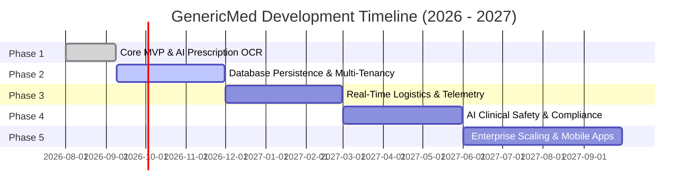

# GenericMed - Project Development Phases & Roadmap

This document outlines the multi-phase engineering and product roadmap for the **GenericMed** platform. It provides AI coding assistants, product managers, and software engineers with a clear roadmap of implemented milestones, current active development, and future technical phases.

---

## Roadmap Overview & Phase Matrix

| Phase | Phase Name | Status | Target Timeline | Core Focus |
| :--- | :--- | :--- | :--- | :--- |
| **Phase 1** | **Core MVP & AI Prescription OCR** |  | Q3 2026 (Completed) | Single Page App UI, 8 View Modes, Gemini 3.8 Flash Rx Parser, Local Fallback Engine, Generic Price Comparison, Automated Test Suite. |
| **Phase 2** | **Database Persistence & Multi-Tenancy** |  | Q4 2026 (Active) | Prisma ORM + SQLite database persistence, multi-tenant schema isolation, JWT Auth endpoints, database seed script. |
| **Phase 3** | **Real-Time Telemetry & Logistics** |  | Q1 2027 | WebSockets live order tracking, rider GPS telemetry, 3PL logistics integration (Dunzo/Porter), SMS/WhatsApp notifications. |
| **Phase 4** | **AI Clinical Safety & CDSCO Compliance** |  | Q2 2027 | Drug-Drug Interaction (DDI) engine, fake Rx fraud detection, CDSCO regulatory PDF audit report generator. |
| **Phase 5** | **Enterprise Scaling & Ecosystem Expansion** |  | Q3 2027 | Multi-region node auto-scaling, B2B generic procurement marketplace, React Native mobile apps, predictive AI stock replenishment. |

---

## Phase 1: Core MVP & AI Prescription OCR Engine

> **Status:** In-Progress (v1.0.0 Refinement)  
> **Objective:** Deliver a fully functional, multi-role interactive prototype demonstrating AI handwritten prescription deciphering, CDSCO salt normalization, patient price savings, multi-tenant dispensary management, and automated integration test coverage.

### Deliverables & Key Accomplishments
- [x] **Hybrid Server Architecture:** Express backend integrated with Vite middleware for dev HMR and static production serving (`server.ts`).
- [x] **AI Vision OCR Pipeline:** Multimodal `gemini-3.8-flash` integration via `@google/genai` for parsing handwritten doctor prescriptions.
- [x] **Local Fallback Engine:** Resilient offline clinical regex parsing model (`getPresetSampleData`) with verified prescription presets (`sample_dolo`, `sample_metformin`, `sample_panto`, `sample_augmentin`).
- [x] **CDSCO Salt Normalization Matrix:** Canonical salt mapping (Paracetamol, Metformin, Pantoprazole, Amoxicillin) with bioequivalence scoring (100% certified rating) and branded MRP price comparisons.
- [x] **Automated Integration Test Suite:** Server health, Rx parser presets, payload validation, and fallback verification tests (`tests/server.test.ts`).
- [x] **8 Interactive View Modes:**
  1. *Customer App View:* Search, price filter, savings % badge, cart drawer slide-over, mobile container frame mode.
  2. *Dispensary Portal View:* SLA fulfillment queue (45m express / 2h standard), rider OTP assignment, SKU stock management.
  3. *Ops Console View:* Platform GMV metrics, SLA breach alerts, Recharts analytics graphs.
  4. *Master Formulary View:* Benchmark pricing, CDSCO category mapping, anomaly flag review.
  5. *Orders & Dispatch View:* Live rider partner queue and OTP verification interface.
  6. *IAM View:* User account management (`Super Admin`, `Ops Lead`, `Pharmacist`, `Support`, `Patient`), drug license numbers, MFA toggles.
  7. *Super Admin View:* Multi-tenant cluster health (`TenantNode`), storage metrics, schema migration triggers.
  8. *System Architecture View:* Visual interactive blueprint of data flow and AI integration.
- [x] **Persistent AI Context Documentation:** Created `decisions.md`, `rules.md`, `memory.md`, and `changelog.md`.

---

## Phase 2: Database Persistence & Multi-Tenant Backend

> **Status:** In-Progress (Target: Q4 2026)  
> **Objective:** Transition from in-memory mock objects to a production-grade PostgreSQL relational database with multi-tenant schema partitioning and encrypted object storage.

### Deliverables & Engineering Milestones
- [ ] **Relational Database Setup:** Implement PostgreSQL database with Prisma ORM schema migrations.
- [ ] **Multi-Tenant Data Partitioning:** Configure schema-per-tenant architecture (`tn_044_schema`, `tn_008_schema`) or Row-Level Security (RLS) policies based on `tenantBound`.
- [ ] **Production Authentication & RBAC:** Replace mock sign-in with secure JWT tokens, bcrypt password hashing, HTTP-only cookies, and TOTP Multi-Factor Authentication.
- [ ] **Prescription Image Archiving:** Integrate AWS S3 / GCP Cloud Storage with SSE-KMS encryption for storing uploaded prescription images securely.
- [ ] **Redis Caching Layer:** Deploy Redis for caching generic salt lookup catalogues, reducing Gemini API redundant calls, and managing session state.
- [ ] **Database Seed Scripts:** Automated seed scripts for seeding CDSCO master formularies and initial pharmacy node records.

---

## Phase 3: Real-Time Telemetry & Logistics Gateway

> **Status:** Planned (Target: Q1 2027)  
> **Objective:** Establish real-time WebSocket communication channels across all user personas and integrate third-party logistics (3PL) fulfillment API gateways.

### Deliverables & Engineering Milestones
- [ ] **WebSocket Server Integration:** Socket.io / native WebSocket gateway for real-time order state broadcasts (`ORDER_ACCEPTED`, `PICKING_COMPLETED`, `DISPATCHED`, `DELIVERED`).
- [ ] **Live Rider GPS Tracking:** Dynamic map view in Customer App and Dispatch Console displaying rider route telemetry.
- [ ] **3PL Logistics API Adapters:** Automated API integration with Dunzo, Porter, and Shadowfax for automatic rider dispatch upon pharmacist picking completion.
- [ ] **SMS & WhatsApp Notification Engine:** Integration with Twilio / Gupshup API for sending instant order confirmation links, delivery updates, and rider OTP codes.
- [ ] **Automated SLA Escalation:** Automated background cron job triggering alerts when order acceptance exceeds 300 seconds.

---

## Phase 4: AI Clinical Safety & CDSCO Regulatory Governance

> **Status:** Planned (Target: Q2 2027)  
> **Objective:** Elevate clinical safety and regulatory audit capabilities with advanced AI clinical reasoning and automated regulatory reporting.

### Deliverables & Engineering Milestones
- [ ] **Drug-Drug Interaction (DDI) Engine:** Gemini 3.8 Pro clinical reasoning module analyzing active prescription combinations to warn patients of harmful salt interactions.
- [ ] **Prescription Fraud & Authenticity Detection:** Computer vision model to verify doctor council registration seals, detect digitally altered Rx images, and flag duplicate prescriptions.
- [ ] **Automated CDSCO Compliance PDF Generator:** One-click generation of CDSCO e-Pharmacy compliant audit ledgers in PDF format for state drug inspectors.
- [ ] **Master Formulary AI Anomaly Monitor:** Automated agent scanning marketplace offers for predatory pricing or unauthorized salt variations violating National List of Essential Medicines (NLEM) price caps.

---

## Phase 5: Enterprise Scaling & Ecosystem Expansion

> **Status:** Planned (Target: Q3 2027)  
> **Objective:** Scale platform infrastructure across multi-region cloud nodes and expand ecosystem offerings to B2B procurement and mobile apps.

### Deliverables & Engineering Milestones
- [ ] **Multi-Region Node Auto-Scaling:** Kubernetes (EKS/GKE) orchestration for regional tenant nodes across South, North, and West India zones.
- [ ] **Native Mobile Applications:** React Native cross-platform mobile apps for iOS and Android with camera Rx scanning and push notifications.
- [ ] **B2B Generic Medicine Procurement Marketplace:** Bulk ordering portal connecting retail dispensaries directly with certified generic pharmaceutical manufacturers.
- [ ] **Predictive AI Inventory Replenishment:** Machine learning model predicting seasonal disease surges (e.g. monsoons) and auto-generating purchase orders for low-stock salts.

---

## Guidelines for Updating `phases.md`

1. **Marking Progress:** When completing tasks in upcoming phases, update the checklist status from `[ ]` to `[x]`.
2. **Updating Versioning:** Record major phase transitions in [`changelog.md`](file:///d:/agenti%20ai%20project/genericmde/changelog.md) alongside `phases.md` updates.
3. **Maintaining Consistency:** Ensure technical specifications in `phases.md` match architectural decisions in [`decisions.md`](file:///d:/agenti%20ai%20project/genericmde/decisions.md) and long-term memory in [`memory.md`](file:///d:/agenti%20ai%20project/genericmde/memory.md).
