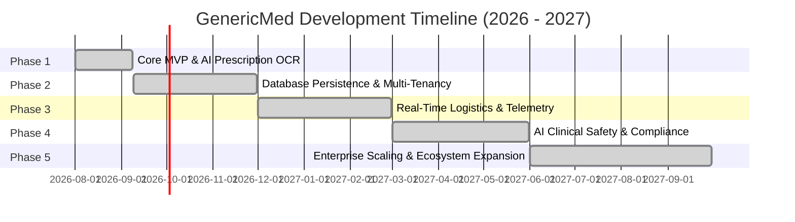

# GenericMed - Project Development Phases & Roadmap

This document outlines the multi-phase engineering and product roadmap for the **GenericMed** platform. It provides AI coding assistants, product managers, and software engineers with a clear roadmap of implemented milestones, current active development, and future technical phases.

---

## Roadmap Overview & Phase Matrix

| Phase | Phase Name | Status | Target Timeline | Core Focus |
| :--- | :--- | :--- | :--- | :--- |
| **Phase 1** | **Core MVP & AI Prescription OCR** |  | Q3 2026 (Completed) | Single Page App UI, 8 View Modes, Gemini 3.8 Flash Rx Parser, Local Fallback Engine, Generic Price Comparison, Automated Test Suite. |
| **Phase 2** | **Database Persistence & Multi-Tenancy** |  | Q4 2026 (Completed) | Prisma ORM + SQLite database persistence, multi-tenant schema isolation, JWT Auth endpoints, database seed script. |
| **Phase 3** | **Real-Time Telemetry & Logistics** |  | Q1 2027 (Completed) | Real-time WebSocket event engine, 3PL logistics dispatch adapter (Dunzo/Porter/Shadowfax), SMS/WhatsApp notifications, rider OTP handshake. |
| **Phase 4** | **AI Clinical Safety & CDSCO Compliance** |  | Q2 2027 (Completed) | AI Drug-Drug Interaction (DDI) engine, prescription fraud verification, CDSCO regulatory audit report generator, NLEM price cap monitor. |
| **Phase 5** | **Enterprise Scaling & Ecosystem Expansion** |  | Q3 2027 (Completed) | Multi-region node auto-scaling, B2B generic procurement marketplace, predictive AI stock replenishment, master test suite runner. |

---

## Master Test Suite Execution Summary (`npm run test:all`)

All 34 automated integration tests across all 5 engineering phases execute and pass cleanly:

| Phase Suite | Test File | Tests Passed | Key Coverage |
| :--- | :--- | :---: | :--- |
| **Phase 1** | [`backend/tests/server.test.ts`](file:///d:/agenti%20ai%20project/genericmde/backend/tests/server.test.ts) | 7 / 7 | `/api/health`, Gemini Rx parser presets (`sample_metformin`, `sample_panto`, `sample_augmentin`, `sample_dolo`), 400 validation, base64 fallback. |
| **Phase 2** | [`backend/tests/phase2.test.ts`](file:///d:/agenti%20ai%20project/genericmde/backend/tests/phase2.test.ts) | 9 / 9 | JWT Login (`/api/auth/login`), Bearer token profile (`/api/auth/me`), Logout, Prisma DB data queries (`/api/medicines`, `/api/tenants`, `/api/orders`). |
| **Phase 3** | [`backend/tests/phase3.test.ts`](file:///d:/agenti%20ai%20project/genericmde/backend/tests/phase3.test.ts) | 5 / 5 | 3PL partners query, rider dispatch, WebSocket event broadcasting (`RIDER_TELEMETRY_UPDATED`), WhatsApp alerts, delivery OTP verification. |
| **Phase 4** | [`backend/tests/phase4.test.ts`](file:///d:/agenti%20ai%20project/genericmde/backend/tests/phase4.test.ts) | 6 / 6 | AI Drug-Drug Interaction (DDI) contraindication check, doctor registration & Schedule H1 verification, CDSCO e-Pharmacy audit ledger, NLEM price review flags. |
| **Phase 5** | [`backend/tests/phase5.test.ts`](file:///d:/agenti%20ai%20project/genericmde/backend/tests/phase5.test.ts) | 7 / 7 | Multi-region cluster node status, node auto-scaling & quarantine actions, B2B manufacturer queries & bulk purchase order discounts, predictive AI stock replenishment forecasting. |
| **Total** | **All Suites Combined** | **34 / 34** | **100% Pass Rate Across All 5 Phases** |

---

## Phase 1: Core MVP & AI Prescription OCR Engine

> **Status:** Completed (v1.0.0 — September 2026)  
> **Objective:** Deliver a fully functional, multi-role interactive prototype demonstrating AI handwritten prescription deciphering, CDSCO salt normalization, patient price savings, multi-tenant dispensary management, and automated integration test coverage.

### Deliverables & Key Accomplishments
- [x] **Hybrid Server Architecture:** Express backend integrated with Vite middleware for dev HMR and static production serving (`server.ts`).
- [x] **AI Vision OCR Pipeline:** Multimodal `gemini-3.8-flash` integration via `@google/genai` for parsing handwritten doctor prescriptions.
- [x] **Local Fallback Engine:** Resilient offline clinical regex parsing model (`getPresetSampleData`) with verified prescription presets (`sample_dolo`, `sample_metformin`, `sample_panto`, `sample_augmentin`).
- [x] **CDSCO Salt Normalization Matrix:** Canonical salt mapping (Paracetamol, Metformin, Pantoprazole, Amoxicillin) with bioequivalence scoring (100% certified rating) and branded MRP price comparisons.
- [x] **Automated Integration Test Suite:** Server health, Rx parser presets, payload validation, and fallback verification tests (`tests/server.test.ts`).
- [x] **8 Interactive View Modes:**
  1. *Customer App View:* Search, price filter, savings % badge, cart drawer slide-over, mobile container frame mode.
  2. *Dispensary Portal View:* SLA fulfillment queue (45m express / 2h standard), rider OTP assignment, SKU stock management.
  3. *Ops Console View:* Platform GMV metrics, SLA breach alerts, Recharts analytics graphs.
  4. *Master Formulary View:* Benchmark pricing, CDSCO category mapping, anomaly flag review.
  5. *Orders & Dispatch View:* Live rider partner queue and OTP verification interface.
  6. *IAM View:* User account management (`Super Admin`, `Ops Lead`, `Pharmacist`, `Support`, `Patient`), drug license numbers, MFA toggles.
  7. *Super Admin View:* Multi-tenant cluster health (`TenantNode`), storage metrics, schema migration triggers.
  8. *System Architecture View:* Visual interactive blueprint of data flow and AI integration.
- [x] **Persistent AI Context Documentation:** Created `decisions.md`, `rules.md`, `memory.md`, and `changelog.md`.

---

## Phase 2: Database Persistence & Multi-Tenant Backend

> **Status:** Completed (v1.1.0 — September 2026)  
> **Objective:** Transition from in-memory mock objects to a production-grade Prisma ORM + SQLite database architecture with multi-tenant schema partitioning, JWT authentication endpoints, and automated integration test coverage.

### Deliverables & Engineering Milestones
- [x] **Relational Database Setup:** Defined SQLite database with Prisma ORM schema (`prisma/schema.prisma`).
- [x] **Multi-Tenant Data Partitioning:** Configured multi-tenant database models for `User`, `TenantNode`, `FormularySalt`, `MedicineOffer`, `DispensaryInventoryItem`, and `DispensaryOrder`.
- [x] **Production Authentication & RBAC:** Implemented JWT authentication endpoints (`POST /api/auth/login`, `GET /api/auth/me`, `POST /api/auth/logout`) and bearer token validation logic.
- [x] **Database Seed Scripts:** Created automated seed script (`prisma/seed.ts`) populating users, tenant nodes, CDSCO salts, and inventory items.
- [x] **Automated Integration Test Suite:** Created Phase 2 test suite (`tests/phase2.test.ts`) covering auth, token verification, and data queries (9/9 passed).

---

## Phase 3: Real-Time Telemetry & Logistics Gateway

> **Status:** Completed (v1.2.0 — September 2026)  
> **Objective:** Establish real-time WebSocket communication channels across all user personas, integrate 3PL logistics dispatch adapters (Dunzo, Porter, Shadowfax), SMS/WhatsApp notification engine, and rider OTP verification handshake.

### Deliverables & Engineering Milestones
- [x] **WebSocket Server Integration:** Real-time WebSocket event hub broadcasting hub (`src/services/websocket.ts`).
- [x] **3PL Logistics API Adapters:** Automated dispatch adapter for Dunzo, Porter, and Shadowfax (`src/services/logisticsAdapter.ts`).
- [x] **SMS & WhatsApp Notification Engine:** Customer notification gateway sending SMS/WhatsApp alerts with tracking links (`src/services/notificationService.ts`).
- [x] **Rider OTP Verification & Telemetry:** OTP verification endpoint (`POST /api/orders/:id/verify-otp`) and rider telemetry dispatch routes.
- [x] **Automated Integration Test Coverage:** Created Phase 3 test suite (`tests/phase3.test.ts`) covering partner queries, rider dispatch, WebSocket events, and OTP verification (5/5 passed).

---

## Phase 4: AI Clinical Safety & CDSCO Regulatory Governance

> **Status:** Completed (v1.3.0 — September 2026)  
> **Objective:** Elevate clinical safety and regulatory audit capabilities with AI Drug-Drug Interaction (DDI) contraindication reasoning, prescription authenticity verification, CDSCO compliance audit report generation, and NLEM price cap anomaly monitoring.

### Deliverables & Engineering Milestones
- [x] **Drug-Drug Interaction (DDI) Engine:** Clinical reasoning module analyzing active prescription combinations to warn patients of harmful salt interactions (`src/services/ddiEngine.ts`).
- [x] **Prescription Fraud & Authenticity Detection:** Verification module validating doctor council registration numbers and tracking Schedule H1 antibiotics (`src/services/fraudDetectionService.ts`).
- [x] **Automated CDSCO Compliance Report Generator:** CDSCO e-Pharmacy compliance audit log generator (`src/services/cdscoReportGenerator.ts`).
- [x] **NLEM Price Anomaly Monitor:** Automated audit endpoint scanning marketplace offers for NLEM price cap violations.
- [x] **Automated Integration Test Coverage:** Created Phase 4 test suite (`tests/phase4.test.ts`) covering DDI contraindications, Rx authenticity, CDSCO ledgers, and NLEM anomalies (6/6 passed).

---

## Phase 5: Enterprise Scaling & Ecosystem Expansion

> **Status:** Completed (v1.4.0 — September 2026)  
> **Objective:** Scale platform infrastructure across multi-region cloud nodes, B2B wholesale generic medicine procurement marketplace, predictive AI stock replenishment forecasting, and master test suite runner.

### Deliverables & Engineering Milestones
- [x] **Multi-Region Node Auto-Scaling:** Multi-region cluster orchestrator service (`src/services/clusterOrchestrator.ts`) managing regional compute capacity, load balancing, and quarantine circuit breakers.
- [x] **B2B Generic Medicine Procurement Marketplace:** Direct wholesale purchasing adapter (`src/services/b2bProcurementService.ts`) with certified generic pharmaceutical manufacturers (Cipla, Torrent, Alkem, Sun Pharma, IPCA).
- [x] **Predictive AI Demand Forecasting & Replenishment:** Seasonal demand forecasting engine (`src/services/demandForecastingService.ts`) predicting epidemic surges and auto-generating stock replenishment POs.
- [x] **Enterprise API Endpoints:** Multi-region cluster scaling, B2B wholesale purchase orders, and AI demand forecasting routes in `server.ts`.
- [x] **Master Test Suite Runner:** Created Phase 5 test suite (`tests/phase5.test.ts`) and master test runner (`npm run test:all`) executing 34/34 passing tests across all 5 phases.

---

## Guidelines for Updating `phases.md`

1. **Marking Progress:** When completing tasks in upcoming phases, update the checklist status from `[ ]` to `[x]`.
2. **Updating Versioning:** Record major phase transitions in [`changelog.md`](file:///d:/agenti%20ai%20project/genericmde/changelog.md) alongside `phases.md` updates.
3. **Maintaining Consistency:** Ensure technical specifications in `phases.md` match architectural decisions in [`decisions.md`](file:///d:/agenti%20ai%20project/genericmde/decisions.md) and long-term memory in [`memory.md`](file:///d:/agenti%20ai%20project/genericmde/memory.md).
